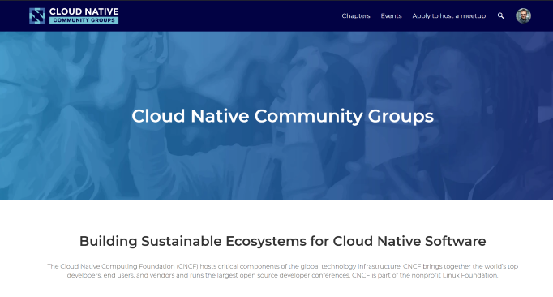

- [Program description](#program-description)
- [Benefits of joining the CNCF Community Groups Program](#benefits-of-joining-the-cncf-community-groups-program)
- [Best Practices](#best-practices)
- [How to apply?](#how-to-apply)
  - [CNCF Projects](#cncf-projects)
  - [How to enable the sync with Meetup.com?](#how-to-enable-the-sync-with-meetupcom)
- [Bevy Training](#bevy-training)
  - [Bevy Help Portal](#bevy-help-portal)
- [Communication](#communication)
  - [Support](#support)
    - [Troubleshooting](#troubleshooting)
    - [FAQ](#faq)
- [Code of Conduct](#code-of-conduct)

## Program description

The Cloud Native Computing Foundation supports the worldwide community of Cloud Native Community Groups (CNCGs) - [community.cncf.io](https://community.cncf.io).
CNCF is currently working on expanding the Cloud Native community worldwide, and we are happy to accept any new local communities to join our network.
If you are interested in joining the list of official CNCF Community Groups, please review the information below.
As of 2021, Cloud Native Community Groups program is powered by the Bevy platform, and managed by the CNCF staff.

## Benefits of joining the CNCF Community Groups Program

For all Cloud Native Community Groups, CNCF offers the following benefits:
- One-time complimentary swag certificate ($100 USD) to the CNCF Store (available after hosting two successful events per chapter within 3 months)
- Joining the CNCF organizer-exclusive Slack channel for collaboration
- Boosting the visibility of your community group and events. See below under the “Communication” section for more details.
- Cost coverage for the hosted community platform, Bevy
  - This includes support from CNCF (Katie Greenley and Audra Montenegro)
  - And monthly office hours hosted by Bevy expert Maia Walshe

## Best Practices

Please check out our [best_practices](./best_practices.md).

## How to apply?

- The Cloud Native Community Group has to be created following the best practices described above.
- Visit community.cncf.io/, and click "Log In" in the top right; you will be redirected to the Linux Foundation sign-in. Use your credentials or create a new account.
- Please file a ticket to the CNCF ServiceDesk - https://servicedesk.cncf.io with the below information:
  - Email
  - First Name
  - Community Group location (country):
  - Community Group location (city/town)
  - If you are an organizer of the Cloud Native Meetups, please put the group URL here:
  - I am interested in joining the Cloud Native Community Groups program because:
  - Please confirm that there are no active Community Groups already existing in your region (if they do - please reach out to the organizers directly,   and do not use this form). NOTE: If the group does exist, but no organizers listed - this group is considered inactive, so please apply using this       form.   
  - You can find all groups at https://community.cncf.io/chapters/.
  - Please note that this form is used for inviting the new Community Groups organizers only. If an active Community Group already exists in your         region, please reach out to the organizers directly (do not use the form above - the submitted application will be declined).
  - Once completed, CNCF staff will review your request and provide approval with access. 

### CNCF Projects

CNCF is also happy to provide the space for projects communities at [community.cncf.io](https://community.cncf.io) (eg. to host the regular community meetings).

To request a new community chapter for the CNCF project, please file a ticket to the CNCF ServiceDesk - servicedesk.cncf.io (available for the project maintainers listed here - [maintainers.cncf.io](https://maintainers.cncf.io/)).

## Bevy Training

CNCF and Bevy have organized the training session for the Community Groups organizers. It has been recorded and now [available on YouTube](https://www.youtube.com/watch?v=_rBdomoYlmc).
You can also access shorter, more specific training videos by having a look at these [self-paced video tutorials](http://vimeo.com/showcase/bevy-virtual-conference) (use password "devfest").

### Bevy Help Portal

Bevy Help Portal is available at <https://help.bevylabs.com/>.

## Communication

Please reach out to us on the #communitygroups channel on the CNCF slack. Please don't use DMs unless strictly necessary as doing so both has the potential of overwhelming project maintainers and others with similar questions lose the benefit of public discussion.

It's best if you use a public communication channel whenever possible; however, if you need to communicate in private, please feel free to send the program admins a note via meetups@cncf.io (please use the public channels for any program-related discussion).

The #socialmedia channel via the CNCF slack workspace is also a great place to post your social media efforts requesting assistance from CNCF to amplify. Just tag Katie Meinders for Twitter, and Jessie Adams-Shore for LinkedIn.

### Support

- If you have any technical difficulties with the platform itself, please reach out to the [Bevy platform support](https://help.bevylabs.com/) directly.
- Troubleshooting: The troubleshooting guide by Bevy is available here: [help.bevylabs.com/article/499-troubleshooting](https://help.bevylabs.com/article/499-troubleshooting)

### Community Group Inactivity

- If your group has more than 90 days of inactivity in the number of events/meetups being help, then you will be deemed an “Inactive” group via the Cloud Native Computing Foundation and removed from [community.cncf.io](https://community.cncf.io/)

#### Testing Video

If you want to test video features, you can use: https://tokbox.com/developer/tools/precall/

#### Troubleshooting

The troubleshooting guide by Bevy is available [here](https://help.bevylabs.com/article/499-troubleshooting).

#### FAQ

Check out [the full doc here](https://github.com/cncf/communitygroups/blob/main/FAQ.md).

## Code of Conduct

Cloud Native Community Groups follow the [CNCF Code of Conduct](https://github.com/cncf/foundation/blob/master/code-of-conduct.md).
