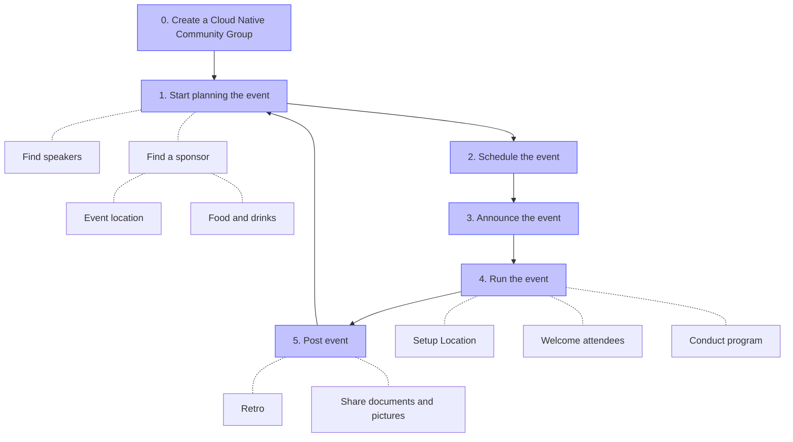

# Best Practices

This page guides running a new Cloud Native Community Group based on the experience of existing ones.
The diagram shows common steps for a meetup to organize.
Depending on the size of the meetup additional steps may be required.



Each of the steps above are now described in more detail.

- [Best Practices](#best-practices)
  - [0. Create the Cloud Native Community Group](#0-create-the-cloud-native-community-group)
  - [1. Start planning you event](#1-start-planning-you-event)
    - [Find Speakers](#find-speakers)
    - [Find sponsors/place](#find-sponsorsplace)
  - [2. Schedule a new event](#2-schedule-a-new-event)
    - [Booking](#booking)
  - [3. Announce the event](#3-announce-the-event)
  - [4. Run the event](#4-run-the-event)
    - [Preparation](#preparation)
    - [Event Introduction](#event-introduction)
    - [Hosting the event](#hosting-the-event)
  - [5. Post event](#5-post-event)
  - [General notes](#general-notes)
    - [CNCF swag](#cncf-swag)
    - [Ask for help](#ask-for-help)


## 0. Create the Cloud Native Community Group

CNCF staff is responsible for creating the Cloud Native Community Groups (see the instructions in the [README.md](../README.md) file, but please see the official [Bevy documentation on how to create a chapter](https://help.bevylabs.com/article/454-create-a-chapter).
It is useful to create a community slack channel `#cloud-native-<city name>` for event coordination ([CNCF Slack](https://app.slack.com/client/T08PSQ7BQ/C015WPLD3F1)).

The **description** of the group is left to the discretion of the organizers.

A brief description of the role of the CNCF and the Cloud Native approach could be added.

You can use text from the [Cloud Native Definition](https://github.com/cncf/toc/blob/master/DEFINITION.md).

The most important thing is to keep an **active group**, with frequent events (ideally once a month). We encourage folks to run either online events or regular meetup events.

Sustaining a group yourself can be challenging to manage. Ideally, it would be best if you had a team of passionate and committed co-organizers.

Joining forces helps spread the load and expands the network.

## 1. Start planning you event

### Find Speakers

You should provide some **form** to allow people to submit their talk proposal similar to this:

https://docs.google.com/forms/d/1V2Y03YMOrIor0M796_WMbYx-fdsn80ngaT-PIum8gUU/edit

> **_Note_**: Make a copy! Please do not edit that form.

When possible, take care to review their presentations.

Attend **conferences** (e.g, DockerCon, CloudNativeCon, etc.) where you can find speakers and meet many people who use or are involved in the CNCF projects that may be interested in joining your group.

### Find sponsors/place

You should contact local technology companies. Many of them are interested in hosting such kind of events.

It is better to find a place in a central location. Downtown would be ideal because it's easier to access for most of the attendees.

If you are on a budget to order food, it is usually best to opt for cold dishes. It is highly recommended to offer vegan and vegetarian options.

## 2. Schedule a new event

First of all, don't forget to thank your sponsors.

Then the essential information is about the agenda. Each talk description should contain:

```
- A short bio of the speaker
- An attractive title
- A paragraph describing the content of the presentation/demo
```

If you're planning a hands-on demo, you should ensure that the WiFi can handle the number of attendees.

Furthermore, you should check you're not limited by some quotas (Cloud provider).

The choice of date and time matters. Most meetups choose Tuesdays, Wednesdays, or Thursdays after work.

### Booking

If the room capacity limits you, you should do an **overbooking**.

Most of the time, there are 30% of people who RSVP, but they never come.

You should think about sending a **reminder** message to the meetup group to ask the people to free their place if they can't come.

## 3. Announce the event

The following steps can be useful to attract more folks for your upcoming event

- Reach out to meetups in the area taking place to share your event (don't forget to return the favor)
- Post on social media channels and notify the CNCF to bump your message
- Place your event in newsletters and podcasts
- Write a CNCF blog post


## 4. Run the event

There are a few tips you should look out for running the event

### Preparation
- **Guide attendees to the event location**: make sure the path from the street to the event location is labeled and clear
- **Prepare the speaker room**: make sure you do a technical check, prepare chairs and all the equipment you might use
- **Guide attendees at the venue**: label the way to restrooms, the elevator, terrace and only other places that are visited during the event. If the location has “restricted” areas, label those too.
- **Food**: prepare a place to put the food (if you order for 100 people, this takes a lot of space), label ingredients for allergies and personal preference (vegan, halal food, …)

### Event Introduction

As an introduction to the event, there are common recommendations you should talk about or make clear to everyone beforehand.

- **CNCF Code of Conduct**: As CNCF Community Event, you oblige by the [code of conduct](https://www.cncf.io/conduct/). You can summarize it to be "excellent to each other"
- **Taking picture's disclaimer**: Make attendees aware that the organizer team takes pictures, with some selective ones getting shared publicly
- **Thank the sponsors**
- **Welcome feedback**: share information where to reach the organizers to ask questions and share feedback about the event.

### Hosting the event

Some learnings facilitating the event:

- **Hosting**: It is useful to select one of the organizers as host to give the event introduction, introduce speakers and in general provide guidance to the audience during the event.
- **Speaker times**: It often happens that a talk takes a little longer than anticipated or the audience is asking many questions. In smaller meetups you can be flexible about it, in bigger events you should interrupt and stick to the schedule.

## 5. Post event

If possible, you should record videos of the presentations and take pictures for social media and the event page to share afterward.

You should also **share** the slides with all members after the event. Optionally, please submit them to the [CNCF Presentations repo](https://github.com/cncf/presentations) on GitHub.

It is also recommended to meet with the other organizers for a debrief to discuss what went well and where to improve for the next meeting.

## General notes

### CNCF swag

If you're a newly created meetup and added to meetups.cncf.io, please reach out to meetups@cncf.io for a complimentary $50 swag certificate to the [CNCF Store](https://store.cncf.io).

### Ask for help

If you have any other questions, you can ask them in the [CNCF Slack](https://app.slack.com/client/T08PSQ7BQ/C015WPLD3F1).
