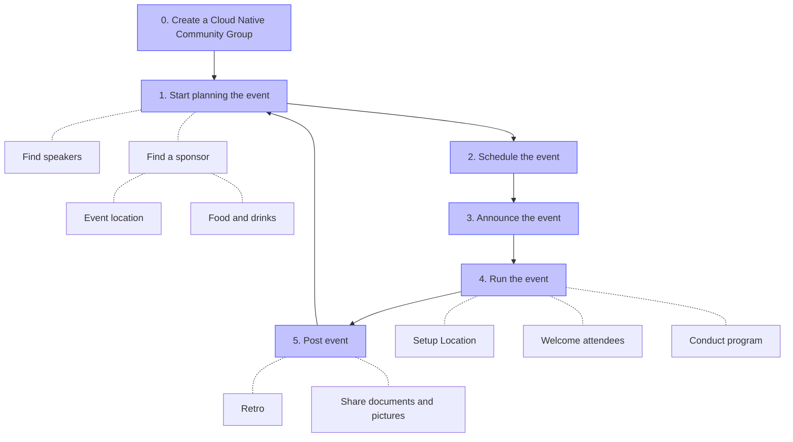

# Best Practices

This page guides running a new Cloud Native Community Group based on the experience of existing ones.
The diagram shows common steps for a meetup to organize.
Depending on the size of the meetup additional steps may be required.



Each of the steps above are now described in more detail.

- [0. Create the Cloud Native Community Group](#0-create-the-cloud-native-community-group)
- [1. Start planning you event](#1-start-planning-you-event)
  * [Find Speakers](#find-speakers)
  * [Find sponsors/place](#find-sponsors-place)
- [2. Schedule a new event](#2-schedule-a-new-event)
  * [Booking](#booking)
- [3. Announce the event](#3-announce-the-event)
- [4. Run the event](#4-run-the-event)
  * [Preparation](#preparation)
  * [Event Introduction](#event-introduction)
  * [Hosting the event](#hosting-the-event)
- [5. Post event](#5-post-event)
- [CNCF Community Groups Host and Organizer Checklists](#cncf-community-groups-host-and-organizer-checklists)
  * [Host Checklist](#cncf-community-groups---host-checklist)
    + [Confirm event details](#confirm-event-details)
    + [Set up the event space](#set-up-the-event-space)
    + [Plan food and refreshments](#plan-food-and-refreshments)
    + [Assist with event check-in](#assist-with-event-check-in)
    + [Foster a welcoming and inclusive atmosphere](#foster-a-welcoming-and-inclusive-atmosphere)
    + [Coordinate with speakers and organizers](#coordinate-with-speakers-and-organizers)
  * [Organizer Checklist](#cncf-community-groups---organizer-checklist)
    + [Manage communications ahead of the event](#manage-communications-ahead-of-the-event)
    + [Manage time during the event](#manage-time-during-the-event)
    + [Facilitate audience engagement](#facilitate-audience-engagement)
    + [Post-event tasks](#post-event-tasks)
- [General notes](#general-notes)
  * [CNCF swag](#cncf-swag)
  * [Ask for help](#ask-for-help)

## 0. Create the Cloud Native Community Group

CNCF staff is responsible for creating the Cloud Native Community Groups (see the instructions in the [README.md](../README.md) file, but please see the official [Bevy documentation on how to create a chapter](https://help.bevylabs.com/article/454-create-a-chapter).
It is useful to create a community slack channel `#cloud-native-<city name>` for event coordination ([CNCF Slack](https://app.slack.com/client/T08PSQ7BQ/C015WPLD3F1)).

The **description** of the group is left to the discretion of the organizers.

A brief description of the role of the CNCF and the Cloud Native approach could be added.

You can use text from the [Cloud Native Definition](https://github.com/cncf/toc/blob/master/DEFINITION.md).

The most important thing is to keep an **active group**, with frequent events (ideally once a month | minimum one every 90 days). We encourage folks to run either online events or regular meetup events.

Sustaining a group yourself can be challenging to manage. Ideally, it would be best if you had a team of passionate and committed co-organizers.

Joining forces helps spread the load and expands the network.

## 1. Start planning your event

### Find Speakers

You should provide a **form** to allow people to submit their talk proposal similar to this:
https://docs.google.com/forms/d/1V2Y03YMOrIor0M796_WMbYx-fdsn80ngaT-PIum8gUU/edit

> **_Note_**: Make a copy! Please do not edit that form.

Pro Tip: Sessionize has a community license that you can apply for, if you host free community events. [Read more](https://sessionize.com/playbook/community-license)

When possible, take care to review their presentations, and always abide by CNCF's values to remain vendor nuetral.

Vendor neutrality in the context of a conference session refers to the principle of maintaining an impartial and unbiased environment during the session, particularly when discussing products, services, or solutions offered by different vendors. The goal is to ensure that the content presented is free from any undue influence, endorsements, or promotional activities related to specific vendors.

By adhering to the concept of vendor neutrality it fosters an environment where knowledge sharing and learning take precedence over commercial interests, benefiting both attendees and the broader industry.

Attend **conferences** (e.g, DockerCon, CloudNativeCon, etc.) where you can find speakers and meet many people who use or are involved in the CNCF projects that may be interested in joining your group.

### Find sponsors/place

You should contact local technology companies. Many of them are interested in hosting such kind of events.

It is better to find a place in a central location. Downtown would be ideal because it's easier to access for most of the attendees.

If you are on a budget to order food, it is usually best to opt for cold dishes. It is highly recommended to offer vegan and vegetarian options.

What to offer the sponsors in return
* Thank your sponsors by highlighting them in the "Sponsor" tab within your Bevy event settings. You can do this by uploading their logo and adding a link that takes people to their website.
* Offer your sponsor to set up a small table in our just outside the room, so people can engage in conversation.
* Offer your sponsor no more than 15 minutes of talking time on the stage. But be sure they are NOT the main content.

## 2. Schedule a new event

Then the essential information is about the agenda. Each talk description should contain:

```
- A short bio of the speaker
- An attractive title
- A paragraph describing the content of the presentation/demo
```

If you're planning a hands-on demo, you should ensure that the WiFi can handle the number of attendees.

Furthermore, you should check you're not limited by some quotas (Cloud provider).

The choice of date and time matters. Most meetups choose Tuesdays, Wednesdays, or Thursdays after work. But use your discretion, since every culture varies.

### Booking

If the room capacity limits you, you should do an **overbooking**.

Most of the time, there are 30% of people who RSVP, but never come. Recently KCDs (1 to 2 day summit-like events have a 92% show rate).

You should think about sending a **reminder** message to the meetup group to ask the people to free their place if they can't come.

## 3. Announce the event

The following steps can be useful to attract more folks for your upcoming event

- Reach out to meetups in the area taking place to share your event (don't forget to return the favor)
- Post on social media channels and notify the CNCF to bump your message. This can be done in the Slack workspace via the #socialmedia channel. Tag Katie Meinder and she will amplify from the CNCF main accounts, provided your post is vendor-nuetral.
- Place your event in newsletters and podcasts
- Write a CNCF blog post that is about 800 words. Submit for review at pr@cncf.io.


## 4. Run the event

There are a few tips you should look out for running the event

### Preparation
- **Guide attendees to the event location**: make sure the path from the street to the event location is labeled and clear
- **Prepare the speaker room**: make sure you do a technical check, prepare chairs and all the equipment you might use
- **Guide attendees at the venue**: label the way to restrooms, the elevator, terrace and only other places that are visited during the event. If the location has “restricted” areas, label those too.
- **Food**: prepare a place to put the food (if you order for 100 people, this takes a lot of space), label ingredients for allergies and personal preference (vegan, halal food, …)

### Event Introduction

As an introduction to the event, there are common recommendations you should talk about or make clear to everyone beforehand.

- **CNCF Code of Conduct**: As CNCF Community Event, you oblige by the [code of conduct](https://www.cncf.io/conduct/). You can summarize it to be "excellent to each other"
- **Taking picture's disclaimer**: Make attendees aware that the organizer team takes pictures, with some selective ones getting shared publicly
- **Thank the sponsor(s)**
- **Welcome feedback**: share information where to reach the organizers to ask questions and share feedback about the event.

### Hosting the event

Some learnings facilitating the event:

- **Hosting**: It is useful to select one of the organizers as host to give the event introduction, introduce speakers and in general provide guidance to the audience during the event.
- **Speaker times**: It often happens that a talk takes a little longer than anticipated or the audience is asking many questions. In smaller meetups you can be flexible about it, in bigger events you should interrupt and stick to the schedule.

## 5. Post event

If possible, you should record videos of the presentations and take pictures for social media and the event page to share afterward.

You should also **share** the slides with all members after the event. Optionally, please submit them to the [CNCF Presentations repo](https://github.com/cncf/presentations) on GitHub.

It is also recommended to meet with the other organizers for a debrief to discuss what went well and where to improve for the next meeting.

## CNCF Community Groups Host and Organizer Checklists

These checklists are designed to support you in your role as a venue host or organizer for the CNCF Community Groups event. They provide a guide to help you prepare and manage the event effectively.

### CNCF Community Groups - Host Checklist

Thanks for being our venue host! This checklist will assist you in preparing the event space and ensuring a smooth experience for attendees.

#### Confirm event details

- [ ] Confirm event date, time, and location.
- [ ] Ensure the venue is available and suitable for the event size.
- [ ] Check if any permits or permissions are required for hosting the event.

#### Set up the event space

- [ ] Arrange seating, tables, and any necessary presentation equipment (e.g., projector, screen, microphones).
- [ ] Test all equipment to ensure proper functionality.
- [ ] Provide clear signage directing attendees to the event space, including a map showing washrooms.

#### Plan food and refreshments

- [ ] Coordinate with the organizers on the type and quantity of food and drinks to be served.
- [ ] Ensure that dietary restrictions and allergens are considered and labeled accordingly.
- [ ] Plan for the timely arrival of food and refreshments, ideally at the start or during a designated break.

#### Assist with event check-in

- [ ] Welcome attendees as they arrive and check them in, if necessary.
- [ ] Provide any necessary information about the venue (restrooms, emergency exits, etc.).
- [ ] Distribute name tags or other identification materials, if applicable.
- [ ] Address accessibility needs at the venue, such as wheelchair access or sign language interpreters.

#### Foster a welcoming and inclusive atmosphere

- [ ] Create a welcoming environment for all attendees, ensuring inclusivity and respect.

#### Coordinate with speakers and organizers

- [ ] Review the event agenda and communicate any last-minute changes.
- [ ] Ensure speakers have everything they need for their presentations (e.g., clicker/slide advancer, possibly USB and USB-C adapters for different machines).
- [ ] Offer assistance in setting up and troubleshooting any presentation equipment.

### CNCF Community Groups - Organizer Checklist

As an organizer, you play a crucial role in managing various aspects of the event. This checklist will guide you through the necessary tasks before, during, and after the event to ensure its success.

#### Manage communications ahead of the event

- [ ] Send speaker logistics ahead of time, including presentation time and setup requirements.
- [ ] Request the speaker's headshot and preferred bio.
- [ ] Ask to review their slides in advance to ensure there are no vendor pitches.
- [ ] Specify screen dimensions (considering 4:3 or 16:9 slide aspect ratio).
- [ ] Allocate Q&A time and any networking opportunities.
- [ ] Build a survey for attendee feedback during the event and generate a QR code.
- [ ] Create housekeeping slides to loop at the beginning and end of the event, including the QR code for the survey.

#### Manage time during the event

- [ ] Serve as the emcee to address light housekeeping items and introduce speakers.
- [ ] Monitor the event's schedule and gently remind the speaker(s) of time limits.
- [ ] Assist with transitions between speakers or activities to maintain the event flow. Use this opportunity for housekeeping announcements.

#### Facilitate audience engagement

- [ ] Encourage attendees to participate in discussions or activities.
- [ ] Assist with Q&A sessions, if applicable.
- [ ] At the end of each session, ask attendees to take time to review the session by filling out the survey you provided on the housekeeping slides.
    - [ ] Note: Asking for feedback while attendees are still seated and the content/experience is fresh in their minds tends to yield better feedback.

#### Post-event tasks

- [ ] Assist with clean-up and restore the event space to its original state.
- [ ] Gather any lost-and-found items for attendees to retrieve.
- [ ] Thank the attendees for their participation and invite them to future events.
- [ ] Upload any videos or photos for post-event promotion.

## General notes

### CNCF swag

If you're a **newly** created meetup and added to community.cncf.io, you have the opportunity earn swag! If you have hosted at last two events within a 90-day perdiod, please reach out to meetups@cncf.io for a complimentary $100 swag certificate to the [CNCF Store](https://store.cncf.io). Just link to the two events of yours that are in reference.

### Ask for help

If you have any other questions, you can ask them in the [CNCF Slack](https://cloud-native.slack.com/archives/C015WPLD3F1).
